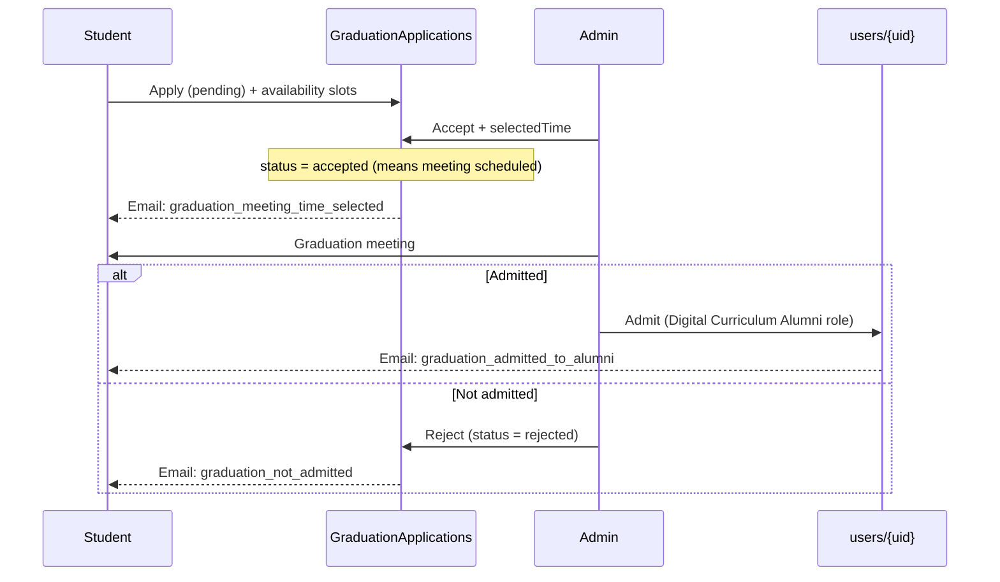

# Brevo transactional email templates (Mortar Digital Curriculum)

Copy each section into **Brevo → Transactional → Templates → New template → Custom HTML**.

HTML files: `docs/brevo-templates/html/*.html` (open in editor → paste body into Brevo).

## Graduation / alumni templates — copy chart

Use these **exact template names** in Brevo (Transactional → Templates) so they match `functions/src/email/brevoTemplates.ts`.

| Template name (Brevo) | Subject | Preview text |
|-----------------------|---------|--------------|
| `graduation_meeting_time_selected` | Your Mortar graduation meeting time is confirmed | We've selected a time from your availability — see the details below. |
| `graduation_admitted_to_alumni` | Welcome to Mortar Alumni | You've been admitted after your graduation meeting — see what's next. |
| `graduation_not_admitted` | Update on your Mortar alumni graduation review | An update after your graduation meeting with our team. |

**Do not create** `graduation_application_accepted` or `graduation_application_rejected` — replaced by the three rows above.

| When to send | Template name |
|--------------|---------------|
| Admin **Accept** + meeting time | `graduation_meeting_time_selected` |
| Admin **Admit** (after meeting) | `graduation_admitted_to_alumni` |
| Admin **Reject** (not admitted) | `graduation_not_admitted` |

---

## Quick reference — all templates (subject & preview)

| Template name (Brevo) | Subject | Preview text |
|-----------------------|---------|--------------|
| `graduation_meeting_time_selected` | Your Mortar graduation meeting time is confirmed | We've selected a time from your availability — see the details below. |
| `graduation_admitted_to_alumni` | Welcome to Mortar Alumni | You've been admitted after your graduation meeting — see what's next. |
| `graduation_not_admitted` | Update on your Mortar alumni graduation review | An update after your graduation meeting with our team. |
| `course_inactive_7_days` | We miss you in the classroom! 📚 | It's been a week since your last visit to MORTAR Masters — jump back in today. |
| `course_inactive_14_days` | Don't lose your momentum! Let's get back on track 🚀 | Two weeks away from MORTAR Masters Online — pick up where you left off. |
| `masters_onboarding_welcome` | Welcome to MORTAR Masters: Online! Let's get started 🌟 | Welcome to The MORTAR Masters: Online — your first lesson is waiting. |
| `event_announcement_to_registrants` | Update: {{ params.event_title }} | A message for registered attendees from the Mortar team. |
| `admin_custom_announcement` | {{ params.headline }} | Message from {{ params.sender_name }} at Mortar. |
| `app_access_code_invite` | Your MORTARverse App Access Code Has Arrived | Ready to expand your reach? Use your secure access code to unlock the MORTARverse app. |

> **Preheader in Brevo:** If the editor has a separate “Preview text” field, use the third column. The HTML files also include a hidden preheader `<span>` for clients that read it from the body.

## Brevo setup notes

| Field in Brevo | What to paste |
|----------------|---------------|
| **Subject** | The line under **Subject** for each template |
| **Preview text** (preheader) | The line under **Preview text** — set in template settings if separate from body |
| **Body** | The HTML block (or open the matching file under `docs/brevo-templates/html/`) |

**Variable syntax:** Use `{{ params.variable_name }}` exactly as shown. Your Functions code sends:

```json
"params": {
  "first_name": "Jordan",
  "course_name": "Mortar Masters Online"
}
```

**Optional fields:** If a param might be empty, either omit the block in code and pass `""`, or pass a friendly default (e.g. `selected_time: "We'll confirm shortly"`).

**Shared params** (send from Functions for every template when possible):

| Param | Example | Purpose |
|-------|---------|---------|
| `first_name` | `Jordan` | Greeting |
| `platform_url` | `https://mortar-stage-stage.up.railway.app` | Primary CTA link (curriculum web) |
| `support_email` | `masters@wearemortar.com` | Footer contact |

After creating each template in Brevo, record its **numeric ID** in `functions/src/email/brevoTemplates.ts` or set `BREVO_TPL_*` env vars.

---

## Graduation / alumni timeline (canonical)

This matches **Admin → Alumni Applications** in Digital Curriculum and how triggers should be wired.



| Step | Admin UI action | Firestore change | Student email template |
|------|-----------------|------------------|------------------------|
| 1 | (none) | `GraduationApplications` created, `status: pending` | *(none — admin push only today)* |
| 2 | **Accept** (with time picker) | `status: accepted`, `selectedTime` set | `graduation_meeting_time_selected` |
| 3 | Meeting happens | — | — |
| 4a | **Admit** | `users/{uid}.roles` includes `Digital Curriculum Alumni` | `graduation_admitted_to_alumni` |
| 4b | **Reject** | `status: rejected` | `graduation_not_admitted` |

**Naming trap in code today:** `acceptGraduationApplication` sets `status: "accepted"` — that means **meeting scheduled**, not admitted to alumni. Alumni admission is only `admitUserToAlumni` on `users/{uid}`.

**Deprecated:** `graduation_application_accepted` — conflated steps 2 and 4a; do not create in Brevo.

**UI note:** Reject is available while `pending` or `accepted`. Your process describes rejection after the meeting; the admin panel also allows early reject. Use the same `graduation_not_admitted` template or split templates if you want different copy.

**Email triggers (Cloud Functions — automatic):**

| Template | Trigger / callable | Admin UI |
|----------|-------------------|----------|
| `graduation_meeting_time_selected` | `onGraduationApplicationEmail` when `selectedTime` is set | Alumni Applications → **Accept** + time |
| `graduation_not_admitted` | same trigger when `status` → `rejected` | **Reject** |
| `graduation_admitted_to_alumni` | `onUserAlumniAdmittedEmail` when `Digital Curriculum Alumni` added to `users.roles` | **Admit** |
| `app_access_code_invite` | `createOrUpdateEligibleUser` / `generateInviteCode` / `promoteToDigitalCurriculumAlumni` | App Access Hub (checkbox **Email invite code**) |
| `course_inactive_7_days` | `scheduledCourseInactiveEmailNudges` — 7+ days idle, incomplete course | *(scheduled daily)* |
| `course_inactive_14_days` | same — 14+ days idle | *(scheduled daily)* |
| `masters_onboarding_welcome` | `onUserOnboardingWelcomeEmail` when `users.onboarding_status` → `complete` | Digital Curriculum onboarding (final save) |
| `event_announcement_to_registrants` | `adminSendEventRegistrantEmail` | Admin → Events tab → **Email registrants** on every event card (all types; shown even at 0 registered) |
| `admin_custom_announcement` | `adminSendCustomAnnouncementEmail` | **Email Management** panel |

---

## 1. `graduation_meeting_time_selected`

**Params:** `first_name`, `meeting_time` (12-hour AM/PM, e.g. `3/16/2026 at 9:00 AM`), `notes` (optional), `platform_url`, `support_email`

`meeting_time` is normalized server-side in `buildEmailParams.graduationMeetingTimeSelectedParams` from admin-selected values (legacy 24-hour strings are converted on send).

**Subject:**  
`Your Mortar graduation meeting time is confirmed`

**Preview text:**  
`We've selected a time from your availability — see the details below.`

**HTML:** [`graduation_meeting_time_selected.html`](brevo-templates/html/graduation_meeting_time_selected.html)

**Trigger:** `acceptGraduationApplication(..., selectedTime)` — `pending` → `accepted` with `selectedTime`.

---

## 2. `graduation_admitted_to_alumni`

**Params:** `first_name`, `next_steps`, `platform_url`, `support_email`

**Subject:**  
`Welcome to Mortar Alumni`

**Preview text:**  
`You've been admitted after your graduation meeting — see what's next.`

**HTML:** [`graduation_admitted_to_alumni.html`](brevo-templates/html/graduation_admitted_to_alumni.html)

**Trigger:** `admitUserToAlumni(userId)` — role change on `users/{uid}`, not on `GraduationApplications`.

**Default `next_steps` for Functions:**  
`If you received an Expansion Network invite code from your administrator, use it in the mobile app. Otherwise, sign in to Digital Curriculum to explore alumni features.`

---

## 3. `graduation_not_admitted`

**Params:** `first_name`, `notes` (optional), `platform_url`, `support_email`

**Subject:**  
`Update on your Mortar alumni graduation review`

**Preview text:**  
`An update after your graduation meeting with our team.`

**HTML:** [`graduation_not_admitted.html`](brevo-templates/html/graduation_not_admitted.html)

**Trigger:** `rejectGraduationApplication` — `status` → `rejected`.

---

## 4. `course_inactive_7_days`

**Params:** `first_name`, `next_lesson_name`, `resume_url`, `platform_url`, `support_email`

**Subject:**  
`We miss you in the classroom! 📚`

**Preview text:**  
`It's been a week since your last visit to MORTAR Masters — jump back in today.`

**HTML:** [`course_inactive_7_days.html`](brevo-templates/html/course_inactive_7_days.html)

**How the feature works:** Daily scheduler (`scheduledCourseInactiveEmailNudges`, 10:00 America/New_York) scans `courseProgress` where `updatedAt` is older than 7 days, `completed` is false, and `brevo_email_inactive_7d_sent_at` is unset. Params include the next incomplete lesson title from `courses/{courseId}.curriculumMapping` and a deep link resume URL. After send, `brevo_email_inactive_7d_sent_at` is set on the progress doc.

---

## Admin email testing panel

Staff with **Admin** or **superAdmin** can open **Admin → Email testing** (`/admin/panel/email-testing`). Enter any recipient email and optional first name, then send a sample for each configured Brevo template. Callables: `adminListTestEmailTemplates`, `adminSendTestTransactionalEmail` (skips user preference opt-outs; logs to `email_activity` with tag `admin_test`).

---

## 5. `course_inactive_14_days`

**Params:** `first_name`, `course_benefit`, `progress_percent`, `next_milestone`, `time_to_next_badge`, `resume_url`, `platform_url`, `support_email`

**Subject:**  
`Don't lose your momentum! Let's get back on track 🚀`

**Preview text:**  
`Two weeks away from MORTAR Masters Online — pick up where you left off.`

**HTML:** [`course_inactive_14_days.html`](brevo-templates/html/course_inactive_14_days.html)

**How the feature works:** Same scheduler as 7-day; sends when idle ≥ 14 days and `brevo_email_inactive_14d_sent_at` is unset (7-day email may have been sent earlier). Progress percent comes from `courseProgress.progress`; next milestone from the module containing the next incomplete lesson.

---

## 6. `masters_onboarding_welcome`

**Params:** `first_name`, `user_email`, `platform_url`, `first_lesson_title`, `start_url`, `schedule_hours`, `support_email`

**Subject:**  
`Welcome to MORTAR Masters: Online! Let's get started 🌟`

**Preview text:**  
`Welcome to The MORTAR Masters: Online — your first lesson is waiting.`

**HTML:** [`masters_onboarding_welcome.html`](brevo-templates/html/masters_onboarding_welcome.html)

**How the feature works:** Firestore trigger `onUserOnboardingWelcomeEmail` on `users/{uid}` when `onboarding_status` changes to `complete` (Digital Curriculum final onboarding save). Sends once per user (`brevo_email_onboarding_welcome_sent_at`). First lesson title and start URL are resolved from `courses/mortar_masters_online` curriculum mapping. Respects `email_pref_course_nudges` unless skipped via admin test send.

**Brevo template ID:** `11` (override with `BREVO_TPL_MASTERS_ONBOARDING_WELCOME`).

---

## 7. `event_announcement_to_registrants`

**Params:** `first_name`, `event_title`, `event_date`, `event_location` (optional), `message_body`, `rsvp_url` (optional), `support_email`

**Subject:**  
`Update: {{ params.event_title }}`

**Preview text:**  
`A message for registered attendees from the Mortar team.`

**HTML:** [`event_announcement_to_registrants.html`](brevo-templates/html/event_announcement_to_registrants.html)

---

## 8. `admin_custom_announcement`

**Params:** `first_name`, `headline`, `message_body`, `sender_name`, `cta_url` (optional), `cta_label` (optional), `support_email`

**Subject:**  
`{{ params.headline }}`

**Preview text:**  
`Message from {{ params.sender_name }} at Mortar.`

**HTML:** [`admin_custom_announcement.html`](brevo-templates/html/admin_custom_announcement.html)

> **Body formatting:** `message_body` is **plain text** from Functions (Brevo escapes `{{ params.message_body }}`, so HTML tags in params would show literally). In the template use one `<p style="white-space:pre-wrap;">{{ params.message_body }}</p>` — see [`admin_custom_announcement.html`](brevo-templates/html/admin_custom_announcement.html). Re-paste into Brevo after updating the repo HTML.

---

## 9. `app_access_code_invite`

**Params:** `first_name`, `invite_code`, `expires_in`, `expires_at`, `app_name`, `redeem_url` (optional), `support_email`

**Subject:**  
`Your MORTARverse App Access Code Has Arrived`

**Preview text:**  
`Ready to expand your reach? Use your secure access code to unlock the MORTARverse app.`

**HTML:** [`app_access_code_invite.html`](brevo-templates/html/app_access_code_invite.html)

---

## Functions `params` reference (for implementers)

```ts
// Wired in: onGraduationApplicationEmail, onUserAlumniAdmittedEmail, onUserOnboardingWelcomeEmail,
// scheduledCourseInactiveEmailNudges, adminSendEventRegistrantEmail, adminSendCustomAnnouncementEmail,
// expansionInvite (app_access_code_invite).
// Builders: functions/src/email/buildEmailParams.ts

// graduation_meeting_time_selected (admin Accept + selectedTime)
{ first_name, meeting_time, notes, platform_url, support_email }

// graduation_admitted_to_alumni (admin Admit → users.roles)
{ first_name, next_steps, platform_url, support_email }

// graduation_not_admitted (admin Reject → status rejected)
{ first_name, notes, platform_url, support_email }

// course_inactive_7_days
{ first_name, next_lesson_name, resume_url, platform_url, support_email }

// course_inactive_14_days
{ first_name, course_benefit, progress_percent, next_milestone, time_to_next_badge, resume_url, platform_url, support_email }

// masters_onboarding_welcome
{ first_name, user_email, platform_url, first_lesson_title, start_url, schedule_hours, support_email }

// event_announcement_to_registrants
{ first_name, event_title, event_date, event_location?, message_body, rsvp_url?, support_email }

// admin_custom_announcement
{ first_name, headline, message_body, sender_name, cta_url?, cta_label?, support_email }

// app_access_code_invite
{ first_name, invite_code, expires_in, expires_at, app_name, redeem_url?, support_email }
```
